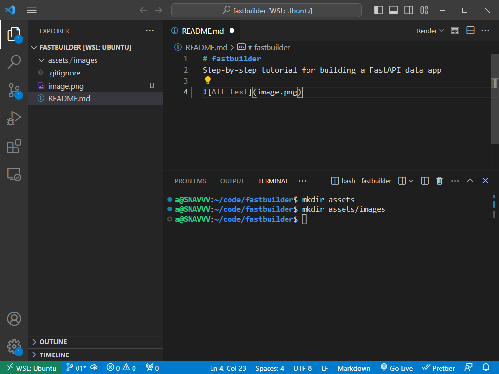

# [`00 <- `](https://github.com/liquidcarbon/fastbuilder/tree/00)**`01`**[` -> 02`](https://github.com/liquidcarbon/fastbuilder/tree/02)

# Step 1.  Add a file.

## 1.1. Switch back to branch `main` and create a new branch.

```bash
git checkout main
git checkout -b 01
```

## 1.2. Open VSCode

```bash
code .
```

Notice that the `README.md` file that we edited in the previous step is back to what it was in the empty repo.  This is because we made the changes in a separate branch.  When collaborating on a project, making changes in separate branches protects the `main`, working branch of the project, and the changes are reviewed and merged with previous code through the pull request process.  Here, we do not intend to merge the branches - rather, they serve as a time machine to go forward and back to follow and retrace our steps of building the project.

If you are following this tutorial, `git checkout X` should give you the final state of the repo after following the steps outlined in the `README.md` of the branch X.  To compare to the previous branch, you can use the compare tool:
https://github.com/liquidcarbon/fastbuilder/compare/00...01

## 1.3. Open VSCode Terminal (```Ctrl + ` ```)

Run the commands shown in the screenshot to create two folders.



## 1.4. Make a screenshot and paste into the README file.

Like in Github editor, the image is pasted as a new file, and a link to new file appears in the editor.  Rename this file and move it to `assets/images`.

## 1.5. Push the changes to a remote branch.

You can run these commands in either VSCode or your system terminal.

```bash
git status
```

Output:
```
a@SNAVVV:~/code/fastbuilder$ git status
On branch 01
Changes not staged for commit:
  (use "git add <file>..." to update what will be committed)
  (use "git restore <file>..." to discard changes in working directory)
        modified:   README.md

Untracked files:
  (use "git add <file>..." to include in what will be committed)
        assets/

no changes added to commit (use "git add" and/or "git commit -a")
```

It is a good practice to check what's going on using `git status` before staging and committing.

```bash
git add .
git commit -m "added a file"
git push -u origin 01
```

Output:
```
a@SNAVVV:~/code/fastbuilder$ git add .
a@SNAVVV:~/code/fastbuilder$ git commit -m "added a file"
[01 9ff1bca] added a file
 2 files changed, 26 insertions(+), 2 deletions(-)
 rewrite README.md (100%)
 create mode 100644 assets/images/01-VSCode.png

a@SNAVVV:~/code/fastbuilder$ git push -u origin 01
Enumerating objects: 11, done.
Counting objects: 100% (11/11), done.
Delta compression using up to 4 threads
Compressing objects: 100% (7/7), done.
Writing objects: 100% (9/9), 67.15 KiB | 16.79 MiB/s, done.
Total 9 (delta 1), reused 0 (delta 0)
remote: Resolving deltas: 100% (1/1), done.
remote: 
remote: Create a pull request for '01' on GitHub by visiting:
remote:      https://github.com/liquidcarbon/fastbuilder/pull/new/01
remote: 
To https://github.com/liquidcarbon/fastbuilder.git
 * [new branch]      01 -> 01
Branch '01' set up to track remote branch '01' from 'origin'.
```
